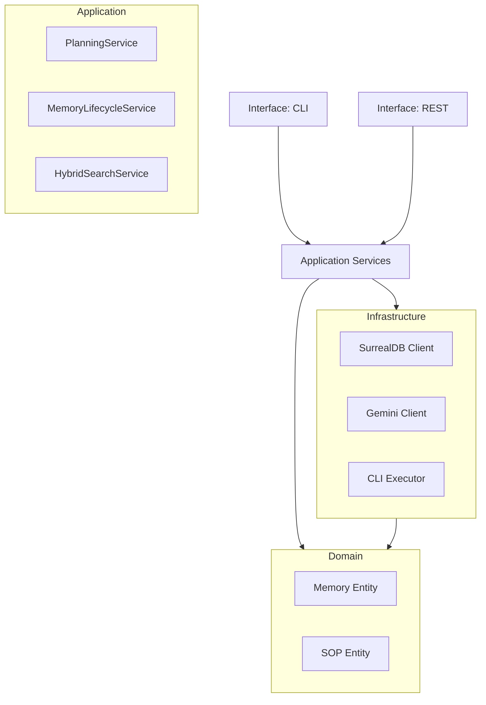

# 03-ARCHITECTURE.md: The Blueprint

**Project**: KHALA v2.1
**Protocol**: DDD (Domain-Driven Design)
**Enforcement**: Strict

---

## 1. Module Boundaries (The Law)

Code must reside in its designated layer. Cross-layer pollution is forbidden.

### 🟢 Domain Layer (`khala/domain/`)
*   **Purpose**: Pure business logic, entities, value objects.
*   **Rules**: NO external dependencies. Pure Python.
*   **Modules**:
    *   `memory`: Core entity (`Memory`), Value Objects (`EmbeddingVector`).
    *   `sop`: Standard Operating Procedures.
    *   `planning`: Planning entities.

### 🔵 Application Layer (`khala/application/`)
*   **Purpose**: Orchestration, Use Cases, Services.
*   **Rules**: Orchestrates Domain objects. Uses Interfaces (Ports).
*   **Services**:
    *   `MemoryLifecycleService`: Manages promotion, decay, consolidation.
    *   `PlanningService`: Decomposes goals.
    *   `SOPService`: Manages SOP execution (Note: Distinct from Domain Service).

### 🟤 Infrastructure Layer (`khala/infrastructure/`)
*   **Purpose**: Adapters, Clients, Persistence.
*   **Rules**: Implements Domain Interfaces. Dirty Details.
*   **Components**:
    *   `SurrealDBClient`: Database interaction. **MUST** handle connection pooling and serialization.
    *   `GeminiClient`: LLM interaction. **MUST** handle retries and cost tracking.
    *   `CLISubagentExecutor`: External tool execution. **MUST** be sandboxed.
    *   `JobProcessor`: Background task execution (Redis/Memory).

### 🟣 Interface Layer (`khala/interface/`)
*   **Purpose**: Entry points.
*   **Rules**: NO business logic.
*   **Endpoints**:
    *   `REST`: FastAPI (`khala/interface/rest/main.py`).
    *   `CLI`: Click (`khala/interface/cli/main.py`).

---

## 2. Illegal Artifacts (The Ban List)

The following patterns are explicitly **BANNED**:
1.  **God Objects**: Any class > 500 lines.
2.  **Zombie Code**: Commented-out blocks > 5 lines.
3.  **Hardcoded Secrets**: Passwords in code.
4.  **Leakage**: Infrastructure imports in Domain layer.
5.  **Implicit Shell Execution**: `subprocess.run` without strict path validation.

---

## 3. Data Flow

