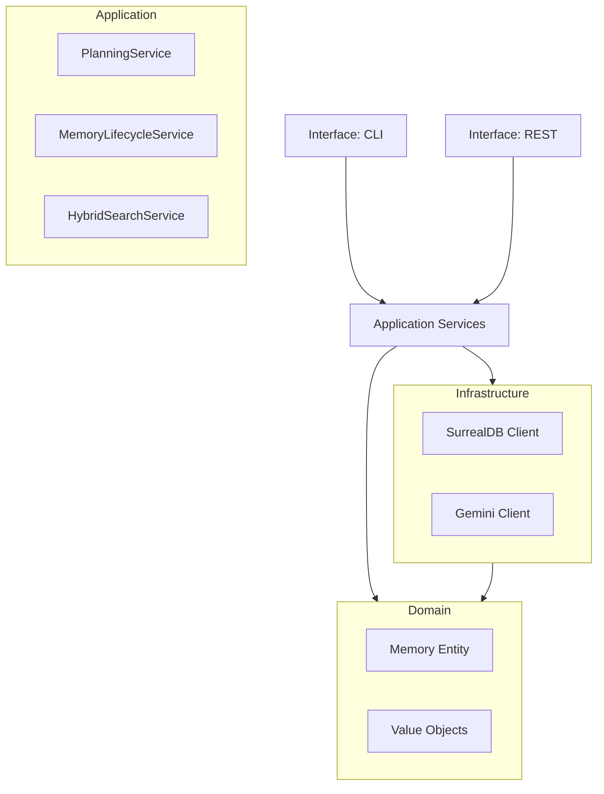

# 03-ARCHITECTURE.md: The Blueprint

**Project**: KHALA v2.0
**Protocol**: DDD (Domain-Driven Design)
**Enforcement**: Strict

---

## 1. Module Boundaries (The Law)

Code must reside in its designated layer. Cross-layer pollution is forbidden.

### 🟢 Domain Layer (`khala/domain/`)
*   **Purpose**: Pure business logic, entities, value objects.
*   **Rules**:
    *   NO external dependencies (no HTTP, no DB clients).
    *   NO side effects.
    *   Pure Python.

### 🔵 Application Layer (`khala/application/`)
*   **Purpose**: Orchestration, Use Cases, Services.
*   **Rules**:
    *   Orchestrates Domain objects.
    *   Uses Interfaces (Ports) for infrastructure.
    *   Example: `MemoryLifecycleService`, `PlanningService`.

### 🟤 Infrastructure Layer (`khala/infrastructure/`)
*   **Purpose**: Adapters, Clients, Persistence.
*   **Rules**:
    *   Implements Domain Interfaces.
    *   Contains `SurrealDBClient`, `GeminiClient`.
    *   **Dirty Details go here.**

### 🟣 Interface Layer (`khala/interface/`)
*   **Purpose**: Entry points (API, CLI).
*   **Rules**:
    *   FastAPI routes, Click commands.
    *   Calls Application Services.
    *   NO business logic allowed here.

---

## 2. Illegal Artifacts (The Ban List)

The following patterns are explicitly **BANNED**:
1.  **God Objects**: Any class > 500 lines.
2.  **Zombie Code**: Commented-out blocks > 5 lines.
3.  **Hardcoded Secrets**: Passwords in code.
4.  **Leakage**: Infrastructure imports in Domain layer.

---

## 3. Component Diagram

